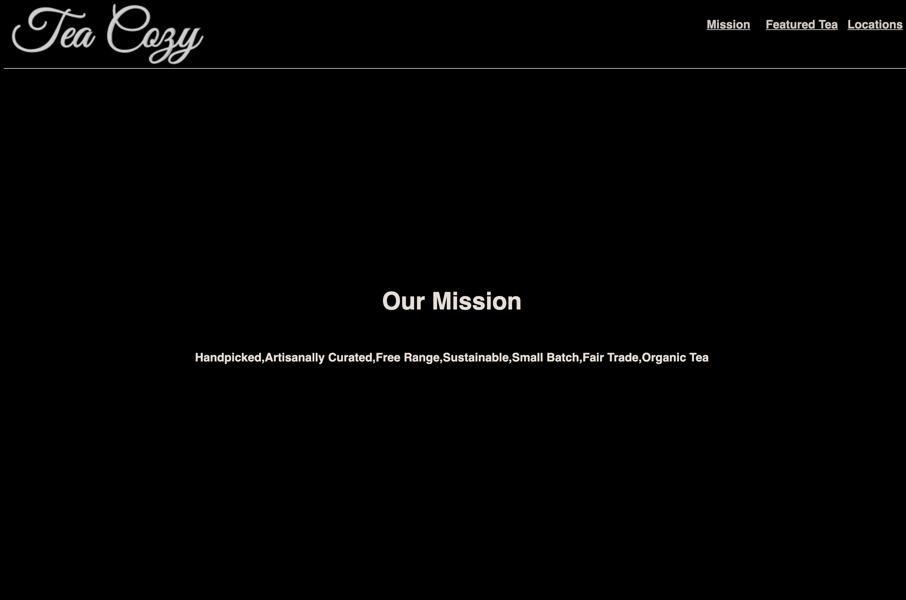

# Tea Cozy

## Description
```
Tea Cozy is a fictional tea shop website, it displays the produce of the business in a appealing and visual way.
```

## Technology used

* HTML
* CSS (Flexbox included)

## Outcome




## Deployment

[Website](https://yinping-520.github.io/tea-cozy/)

## Repo

[Github Repo](https://github.com/yinping-520/tea-cozy)

